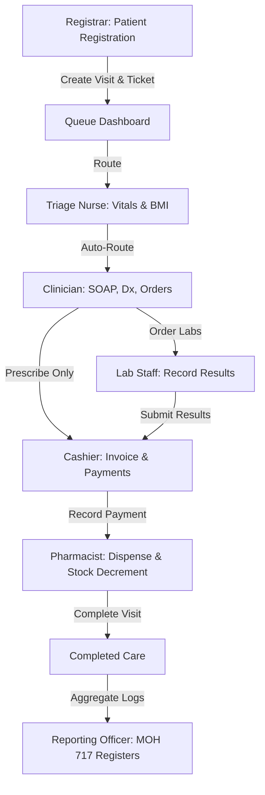

# Egesa Health - Architecture & Role-to-Dashboard Matrix

This document defines the Role-Based Access Control (RBAC) permissions matrix and the connected patient workflow for the Egesa Health MOH Patient Record Keeping system.

---

## 🗺️ Patient Care Workflow

Below is the sequential diagram of the patient journey through the clinic, illustrating how dashboards interact and push records from registration to dispensing and reporting.

---

## 📊 Role-to-Dashboard Access Matrix

The following table maps the 10 system roles to the various functional dashboards. 

*   **F**: Full Access (Read, Write, Execute)
*   **R**: Read-only Access (Viewing metrics/summaries)
*   **-**: No Access

| System Role | Login & Routing | Patient Dashboard | Queue Dashboard | Triage Desk | Clinician Consult | Lab Desk | Pharmacy Desk | Ward/ Inpatient | Billing Cashier | Mgmt Dashboard | MOH Reports | Admin Settings |
| :--- | :---: | :---: | :---: | :---: | :---: | :---: | :---: | :---: | :---: | :---: | :---: | :---: |
| **1. System Admin** | **F** | R | R | R | - | - | - | - | - | R | R | **F** |
| **2. Facility Admin** | **F** | R | **F** | R | R | R | R | R | R | **F** | R | R |
| **3. Registrar** | **F** | **F** *(Demographics)* | **F** | - | - | - | - | - | - | - | - | - |
| **4. Triage Nurse** | **F** | R | R | **F** | - | - | - | - | - | - | - | - |
| **5. Clinician** | **F** | **F** | R | R | **F** | R | R | **F** | - | - | - | - |
| **6. Lab Staff** | **F** | R | - | - | - | **F** | - | - | - | - | - | - |
| **7. Pharmacy Staff** | **F** | R | - | - | - | - | **F** | - | - | - | - | - |
| **8. Ward Nurse/MD** | **F** | **F** | R | R | **F** | R | R | **F** | - | - | - | - |
| **9. Billing Officer** | **F** | R | - | - | - | - | - | - | **F** | - | - | - |
| **10. Reporting Officer** | **F** | R | - | - | - | - | - | - | - | R | **F** | - |

---

## 🔑 Operational Highlights

### A. Automatic Routing
Upon logging in, the system reads the user's role and automatically routes them to their primary workspace. For example:
*   A user with the role **nurse** lands directly on the **Triage Desk** showing the pending vitals queue.
*   A user with the role **clinician** lands on the **OPD Consultation** list.

### B. Shared Patient Timeline
The central **Patient Dashboard** acts as the single source of truth. Each department logs specific events (Vitals, Lab Results, Invoices, Dispensing events) which append directly to the patient's record timeline.

### C. Financial Integration
Services cannot be rendered in the Pharmacy until the Cashier logs the invoice payment in the **Billing Desk**. Setting a invoice to `paid` triggers the ticket to move from Billing to the Pharmacy queue.
