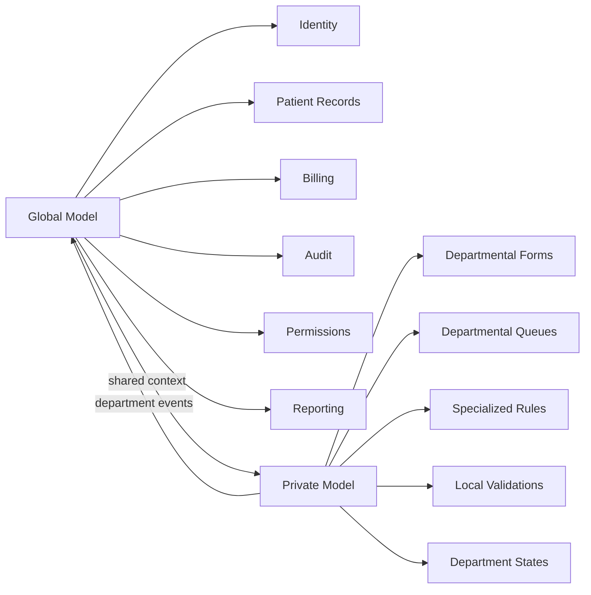
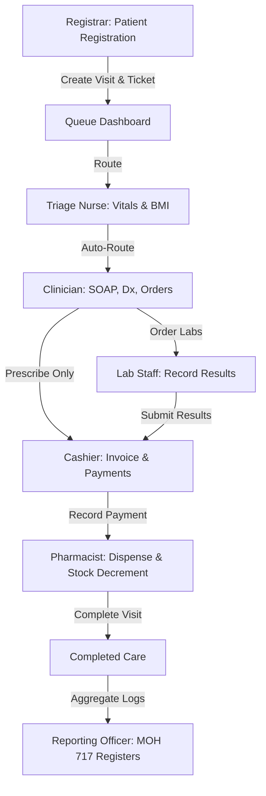
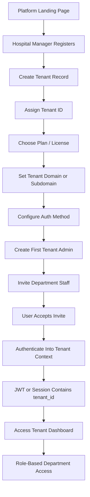
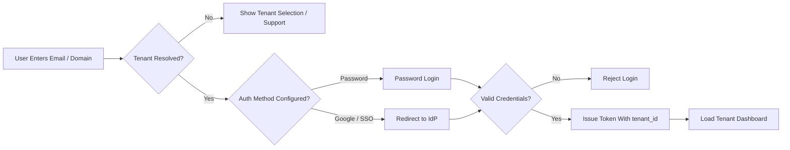

# Egesa Health - Architecture & Role-to-Dashboard Matrix

This document defines the Role-Based Access Control (RBAC) permissions matrix and the connected patient workflow for the Egesa Health MOH Patient Record Keeping system.

---

## 🧠 Model Architecture Strategy

To keep the platform consistent and scalable, the system should use two layers of data and business logic:

### Global model

Use the global model for shared platform concerns such as:

- identity
- patient records
- billing
- audit
- permissions
- reporting

### Private model

Use the private model for department-specific behavior such as:

- departmental forms
- departmental queues
- specialized rules
- local validations
- department-specific states

This separation helps preserve a single source of truth for core patient and administrative data while allowing each department to evolve independently without breaking shared workflows.

---

## 🗺️ Patient Care Workflow

Below is the sequential diagram of the patient journey through the clinic, illustrating how dashboards interact and push records from registration to dispensing and reporting.

---

## 📊 Role-to-Dashboard Access Matrix

The following table maps the 10 system roles to the various functional dashboards.

- **F**: Full Access (Read, Write, Execute)
- **R**: Read-only Access (Viewing metrics/summaries)
- **-**: No Access

| System Role               | Login & Routing |   Patient Dashboard    | Queue Dashboard | Triage Desk | Clinician Consult | Lab Desk | Pharmacy Desk | Ward/ Inpatient | Billing Cashier | Mgmt Dashboard | MOH Reports | Admin Settings |
| :------------------------ | :-------------: | :--------------------: | :-------------: | :---------: | :---------------: | :------: | :-----------: | :-------------: | :-------------: | :------------: | :---------: | :------------: |
| **1. System Admin**       |      **F**      |           R            |        R        |      R      |         -         |    -     |       -       |        -        |        -        |       R        |      R      |     **F**      |
| **2. Facility Admin**     |      **F**      |           R            |      **F**      |      R      |         R         |    R     |       R       |        R        |        R        |     **F**      |      R      |       R        |
| **3. Registrar**          |      **F**      | **F** _(Demographics)_ |      **F**      |      -      |         -         |    -     |       -       |        -        |        -        |       -        |      -      |       -        |
| **4. Triage Nurse**       |      **F**      |           R            |        R        |    **F**    |         -         |    -     |       -       |        -        |        -        |       -        |      -      |       -        |
| **5. Clinician**          |      **F**      |         **F**          |        R        |      R      |       **F**       |    R     |       R       |      **F**      |        -        |       -        |      -      |       -        |
| **6. Lab Staff**          |      **F**      |           R            |        -        |      -      |         -         |  **F**   |       -       |        -        |        -        |       -        |      -      |       -        |
| **7. Pharmacy Staff**     |      **F**      |           R            |        -        |      -      |         -         |    -     |     **F**     |        -        |        -        |       -        |      -      |       -        |
| **8. Ward Nurse/MD**      |      **F**      |         **F**          |        R        |      R      |       **F**       |    R     |       R       |      **F**      |        -        |       -        |      -      |       -        |
| **9. Billing Officer**    |      **F**      |           R            |        -        |      -      |         -         |    -     |       -       |        -        |      **F**      |       -        |      -      |       -        |
| **10. Reporting Officer** |      **F**      |           R            |        -        |      -      |         -         |    -     |       -       |        -        |        -        |       R        |    **F**    |       -        |

---

## 🔑 Operational Highlights

### A. Automatic Routing

Upon logging in, the system reads the user's role and automatically routes them to their primary workspace. For example:

- A user with the role **nurse** lands directly on the **Triage Desk** showing the pending vitals queue.
- A user with the role **clinician** lands on the **OPD Consultation** list.

### B. Shared Patient Timeline

The central **Patient Dashboard** acts as the single source of truth. Each department logs specific events (Vitals, Lab Results, Invoices, Dispensing events) which append directly to the patient's record timeline.

### C. Financial Integration

Services cannot be rendered in the Pharmacy until the Cashier logs the invoice payment in the **Billing Desk**. Setting a invoice to `paid` triggers the ticket to move from Billing to the Pharmacy queue.

---

## 🏢 Multi-Tenant Authentication & Onboarding

This section defines the multi-tenant (facility-scoped) authentication and onboarding design for Eagle Tech HMIS. The system uses a centralized platform architecture while enforcing strict tenant (facility) data isolation at the API and database levels.

### 🗺️ Multi-Tenant Authentication Architecture

Below is the platform-wide onboarding and provisioning flow:

### 🔑 Tenant Login Flow

The following flow resolves the tenant and executes authentication:

---

## 📋 Standard Workflows

### 1. Registration & Tenant Provisioning Workflow

- **Platform Sign-up**: The facility manager registers on the platform. The system supports email/password signup and Google OAuth.
- **Tenant Creation**: Upon payment verification, a new record is created in the `facilities` table. A unique `facility_id` (Tenant ID) and `facility_code` (MOH identifier) are generated.
- **Admin Configuration**: The system creates a user record in `users` and assigns them the `admin` role in the `profiles` table, linked to the new `facility_id`.
- **Licensing Gating**: The active plan (Basic Clinic, Standard Hospital, or Enterprise System) is recorded. The system uses this tier to gate active user count, custom domains, and modules.

### 2. Invite & Staff Provisioning Workflow

To maintain facility isolation, staff members are added to a specific tenant container using the role-request workflow:

- **Staff Sign-up**: A new healthcare worker signs up on the central platform.
- **Role & Facility Request**: The worker submits a request containing their full name, email, the desired `facility_id` (Facility Code), and their requested clinical role (e.g., `clinician`, `nurse`, `pharmacist`).
- **Admin Review**: The request is created in the `role_requests` table with a `pending` status. The Facility Administrator views all pending requests scoped to their `facility_id`.
- **Approval & Profile Activation**: Upon admin approval, the system:
  1. Creates a record in the `profiles` table matching the staff member's ID and email, assigning the approved role and `facility_id`.
  2. Updates the `role_request` status to `approved`.
  3. Authorizes the staff member to log in and access dashboards matching their role.

### 3. SSO & Custom Domain Setup

- **Subdomain Routing**: Hospitals on the enterprise plan can set up custom subdomains (e.g., `stlukes.eagletechsolutions.tech`) or custom domains (e.g., `portal.stlukes.org`).
- **Identity Provider (IdP) Setup**: Tenant admins can optionally enforce Google Sign-in or integrate external SSO (SAML/OIDC) for their domain. When a user logs in, entering an email with that domain redirects them to the configured Identity Provider.

### 4. Security Rules & Data Isolation

- **Tenant Isolation**: Every database query for tenant data (e.g., patient records, vitals, queues, invoices, orders) is intercepted by the backend DB Proxy. The proxy reads the authenticated user's `facility_id` from their verified JWT token and automatically appends a `facility_id = user.facility_id` filter to prevent cross-tenant leakage.
- **Token Verification**: User payloads are signed as JWT tokens on the backend using `jsonwebtoken` with a 12-hour expiry. Every token carries the user's role and `facility_id`.

---

## 📊 Reference Tables

### Tenant Onboarding

| Step | Who acts         | What happens                           | Output                             |
| ---- | ---------------- | -------------------------------------- | ---------------------------------- |
| 1    | Hospital manager | Registers on the platform.             | Platform account created.          |
| 2    | Hospital manager | Creates tenant/hospital profile.       | Tenant record and tenant ID.       |
| 3    | System           | Applies plan/license.                  | Active tenant entitlement.         |
| 4    | Hospital manager | Sets subdomain/custom domain.          | Tenant URL.                        |
| 5    | Hospital manager | Configures Google sign-in or SSO.      | Tenant auth policy.                |
| 6    | Hospital manager | Creates first tenant admin.            | Admin user attached to tenant.     |
| 7    | Tenant admin     | Invites staff by email/request.        | Invite/role request sent.          |
| 8    | Staff member     | Accepts invite and logs in.            | Tenant-scoped session.             |
| 9    | System           | Issues JWT/session with tenant claims. | Tenant isolation on every request. |

### Authentication Methods

| Method             | Best for                             | Advantages                 | Caution                           |
| ------------------ | ------------------------------------ | -------------------------- | --------------------------------- |
| Email/password     | MVP and small facilities             | Simple to implement.       | Needs password reset flow.        |
| Invite-based login | Staff onboarding                     | Safe and controlled.       | Requires admin action.            |
| Domain-based login | Hospitals with managed email domains | Fast user recognition.     | Needs domain verification.        |
| Google sign-in     | Facilities using Google Workspace    | Easy user experience.      | Requires tenant-level IdP config. |
| SSO (SAML/OIDC)    | Larger hospital groups               | Strong enterprise control. | More setup and maintenance.       |

### Authorization Matrix

| Layer       | Rule                                                       | Enforced by                                     |
| ----------- | ---------------------------------------------------------- | ----------------------------------------------- |
| Platform    | Can manage tenants, billing, licenses, support.            | Platform admin.                                 |
| Tenant      | Can manage only that hospital’s users, settings, and data. | `tenant_id` (mapped as `facility_id`) in token. |
| Department  | Can access only assigned department workflows.             | Role and department claims.                     |
| Data access | Every query is filtered by tenant scope.                   | API + DB proxy policies.                        |

### Recommended Token Payload Content

Every authenticated session contains a signed JWT with the following claims:

- `id` (User ID)
- `email`
- `full_name`
- `role` (e.g. `admin`, `clinician`, `nurse`, etc.)
- `facility_id` (Tenant ID)
- `facility_name`
- `facility_logo`
- `exp` (Session expiry timestamp)

### Operational Security Rules

1. **Mandatory Tenant Bounds**: A profile must always belong to at least one valid facility.
2. **Administrative Isolation**: Tenant admins can only manage or invite users for their own `facility_id` and have no visibility of other tenants.
3. **Dynamic Configuration**: Tenant-specific SSO settings can be toggled by the admin post-onboarding.
4. **License Status Enforcement**: Expired licenses restrict clinical and onboarding operations.

### MVP Phase-1 Features

1. Platform register/login.
2. Tenant registration (branding & checkout).
3. Role-request workflow for staff provisioning.
4. Tenant-scoped token generation on login.
5. Automatic dashboard routing.
6. DB Proxy automatic tenant/facility filtering.
